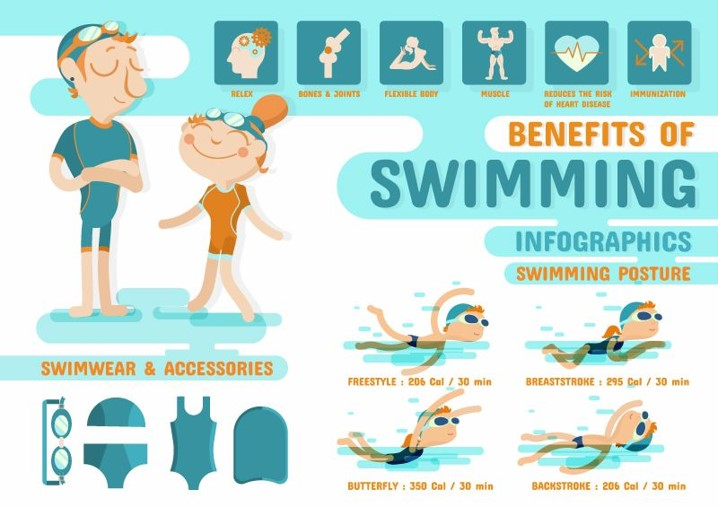

# 泳协

## 20190512
* 自由泳打腿：打腿时大腿要用力。
* 用腹部力量，保持上半身不晃动。
* 在水中尽量与水面平行地游。
* 跳水：下蹲，微微前倾，指尖平缓如水，蹬壁出去。
* 跳水：可以先戴泳镜，再戴泳帽，泳帽戴下来点，就不容易掉了。

## 20190519
* 自由泳打腿：用上大腿，以一只脚左右的幅度上下打腿，脚微内八内扣，可以试试有意绷脚打腿。
* 自由泳手：划水拍大腿后，高肘出水。如果是只提手肘，小臂出水和伸前时都是放松的，只有划水时做功。
* 自由泳手：一只手划水时，另一只手往前伸一伸，自然转肩，不转头。
* 池边坐着跳水：身体好好地入水后，再蹬壁
* 跳水：伸直的双手可以控制潜水的位置，抬手上浮压手下潜，离水面一定距离平行漂最合适

## 20190601
* 跳水：头压低，手伸直搭前方，眼睛看自己的腿脚，有跳远的感觉。
* 自由泳换气：头贴紧手臂，一只手划水时，另一只手往前伸的感觉，转肩转头，嘴露出水面够吸气就好。
* 自由泳不换气手划水：转肩，不转头。
* 平时可以练平板支撑等，加强身体核心力量。
* 动态平板支撑：依次伸直右手、右腿、左腿和左手，能锻炼到更多的肌肉，维持10~15秒。
* 俄罗斯转体：身体坐着手臂抱拳左右，还有其余动作，身体和双腿收缩

## 2190602
* 自由泳打腿：初学者两划六打腿，熟练掌握后偷懒可以两划两打腿。先学：把膝盖绷直，大腿出力，上下打腿；熟悉后以后再学鞭状打腿。
* 自由泳️头贴大臂，划完手手高肘出水，多练核心区有利于稳定性，打腿打的麻利有利于稳定性。
* 双人上半身（a前坐b后站）拉伸，每个动作保持十几秒：
  ** 1、a双手后交叉，b握a双手，上提；
  ** 2、a双手上扬，b握住a大臂，膝盖顶住a后颈，往后拉a大臂
  ** 3和4、拉伸左右手，a左边或者右边伸手弯曲，b压住大臂和小臂，拉伸后再敲打胳膊
  ** 5、“死亡”拉伸，a双手抱头低头，b双手下进上出按住a后脑勺上的双手，拉起a的胳膊。

* 单人上半身拉伸，压墙壁：
  ** 1、身体斜侧，将手肘靠在墙上，拉手肘能加大拉伸
  ** 2、俯身伸出双手压在墙上
  ** 3、伸出单手，往反方向压在墙上

* 下半身拉伸：
  ** 1、脚腱拉伸，站在台阶，将脚掌伸出一半下压
  ** 2、大腿拉伸，小腿后弯曲，反手抱住脚踝往上抬
  ** 3、小腿拉伸，伸脚到台阶上，弯曲身体下压

* 肌肉放松方法：搓毛巾一样搓对方手臂
